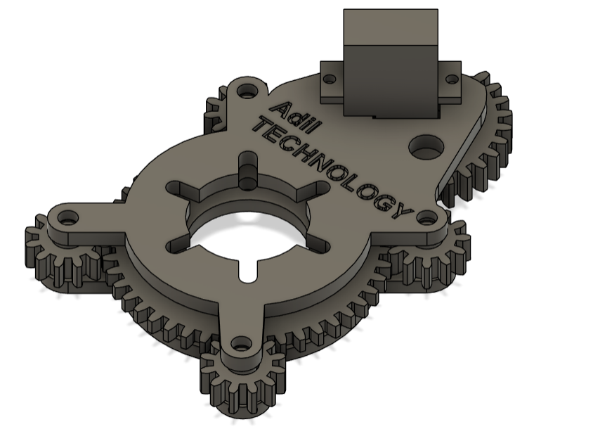
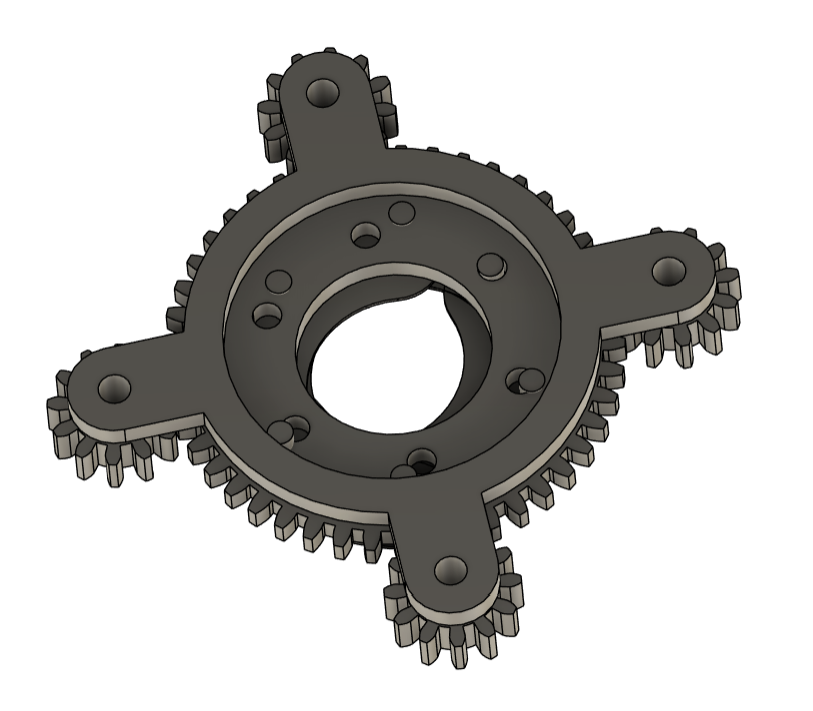

# Motorized Full Circle Iris Diaphragm

Arduino-driven, full-circle **iris diaphragm** actuated by an SG90 micro servo.  
**Built in August 2024.** This repository includes firmware, 3D-printable parts, wiring notes, assembly steps, and calibration guidance.

> **License & Patent Notice:** This project is released under a unified **Non‑Commercial, No‑Derivatives** license. No patent rights are granted. See **[LICENSE](LICENSE)** and **[NOTICE.md](NOTICE.md)** for details.

---

## Table of Contents
- [Overview](#overview)
- [Key Features](#key-features)
- [Repository Structure](#repository-structure)
- [Bill of Materials (BOM)](#bill-of-materials-bom)
- [3D Prints](#3d-prints)
- [Wiring](#wiring)
- [Firmware](#firmware)
  - [Example 1: 45°–135° Sweep](#example-1-45–135-sweep)
  - [Example 2: Potentiometer Control (45°–135°)](#example-2-potentiometer-control-45–135)
- [Calibration](#calibration)
- [Print Settings (Reference)](#print-settings-reference)
- [Assembly Guide (Quick Outline)](#assembly-guide-quick-outline)
- [Troubleshooting](#troubleshooting)
- [Performance Notes](#performance-notes)
- [Git LFS (Large Files)](#git-lfs-large-files)
- [Roadmap](#roadmap)
- [How to Cite](#how-to-cite)
- [License & Patent](#license--patent)
- [Acknowledgements](#acknowledgements)
- [Changelog](#changelog)

---

## Overview

This is a compact, motorized **iris diaphragm** designed for phones/cameras, lab setups, and demos where **variable aperture** and smooth actuation are needed. The mechanism provides **full-circle blade coverage** and is driven by an **Arduino** controlling an **SG90 micro servo**. Two firmware examples are provided: a 45°–135° **sweep demo** and a **potentiometer-controlled** mode within the same safe angle range.

<p align="center">
  <br>
  <em>Assembled unit (example photo)</em>
</p>

---

## Key Features
- **Full-circle iris** with smooth aperture motion.
- **Arduino + SG90** micro-servo control.
- **Two firmware modes:** timed sweep and potentiometer control.
- **3D-printed parts** (PLA / ABS / PETG).
- **Non-commercial research/education use.**

---

## Repository Structure

```
.
├─ README.md
├─ LICENSE
├─ NOTICE.md
├─ firmware/
│  └─ examples/
│     ├─ sweep_45_135/      # 45°↔135° sweep demo (English comments)
│     │  └─ sweep_45_135.ino
│     └─ pot_control/       # 45°–135° via potentiometer (A0)
│        └─ pot_control.ino
├─ hardware/
│     ├─ top.3mf
│     ├─ butom.3mf
│     ├─ servogear.3mf
│     ├─ middlegear.3mf
│     ├─ smallgear.3mf
│     ├─ irs.3mf
│     └─ irsstopper.3mf
└─ docs/
   └─ images/
      ├─ image1.png
      ├─ image2.png
      ├─ image3.png
      ├─ image4.png
      ├─ image5.png
      ├─ image6.png
      └─ image7.png
```
---

## Bill of Materials (BOM)

**Core**
- **Servo:** SG90 9g micro servo (×1)
- **Controller:** Arduino Uno or Nano (or any 5 V logic MCU) (×1)
- **Filament:** PLA / ABS / PETG (~1 kg; black recommended for blades)

**Fasteners**
- **M3** socket-head screws (assorted 6–16 mm, qty depends on design)
- **M3** hex nuts (qty depends on design)
- **M5** screw/bolt or shaft (central pivot, depending on design)
- **Washers/spacers** (M3/M5, optional)

**Electrics**
- Dupont jumper wires (male/female as needed)
- USB cable for programming
- 5 V power supply (≥ 1 A) for servo (recommended)

**Optional**
- M3 heat-set inserts, thread-locker, cyanoacrylate

**Tools**
- FDM 3D printer (0.4 mm nozzle suggested)
- Hex keys, small screwdrivers, flush cutters

---

## 3D Prints

Source files are under `hardware/3d/`:

| File | Description |
|---|---|
| `top.3mf` | Upper shell / cover |
| `butom.3mf` | Lower shell / base (original spelling kept) |
| `servogear.3mf` | Servo output gear |
| `middlegear.3mf` | Intermediate gear |
| `smallgear.3mf` | Small gear |
| `irs.3mf` | Iris blade/plate component(s) |
| `irsstopper.3mf` | Iris stopper / limiter |

> **Tip:** Print gears to maximize tooth quality and concentricity; avoid supports where possible.

Example views:

<p align="center">
  <br>
  <em>Exploded view / parts layout</em>
</p>

---

## Wiring

### Servo (SG90)
| Servo lead | Arduino |
|---|---|
| Signal (orange/yellow) | **D9** |
| VCC (red) | **5V** |
| GND (brown/black) | **GND** |

### Potentiometer (optional, 10 kΩ)
| Pot pin | Arduino |
|---|---|
| One end | **5V** |
| Other end | **GND** |
| Wiper | **A0** |

> If you power the servo from an **external 5 V source**, always **share grounds** (external GND ↔ Arduino GND).

---

## Firmware

Open the sketches in Arduino IDE, select your board/port, and upload.

### Example 1: 45°–135° Sweep

Path: `firmware/examples/sweep_45_135/sweep_45_135.ino`

```cpp
#include <Servo.h>

Servo myServo;
const int servoPin = 9;

// Motion settings
const int minAngle   = 45;   // lower limit (degrees)
const int maxAngle   = 135;  // upper limit (degrees)
const int stepDeg    = 1;    // angle increment per step (degrees)
const int stepDelay  = 10;   // delay between steps (milliseconds)

void setup() {
  myServo.attach(servoPin);    // attach servo signal to D9
  myServo.write(minAngle);     // start at 45°
  delay(500);                  // small settling delay
}

void loop() {
  // Sweep 45° -> 135°
  for (int a = minAngle; a <= maxAngle; a += stepDeg) {
    myServo.write(a);
    delay(stepDelay);
  }

  // Sweep 135° -> 45°
  for (int a = maxAngle; a >= minAngle; a -= stepDeg) {
    myServo.write(a);
    delay(stepDelay);
  }
}
```

### Example 2: Potentiometer Control (45°–135°)

Path: `firmware/examples/pot_control/pot_control.ino`

```cpp
#include <Servo.h>

Servo myServo;

const int servoPin = 9;     // servo signal on D9
const int potPin   = A0;    // potentiometer wiper on A0

// Angle limits
const int minAngle = 45;    // lower mechanical limit
const int maxAngle = 135;   // upper mechanical limit

// Optional smoothing / update settings
const int avgSamples = 10;  // moving-average window (reduce jitter)
const int updateMs   = 15;  // write interval to servo

int lastAngle = -1;

// Read potentiometer with simple moving average
int readPotAveraged(int samples) {
  long sum = 0;
  for (int i = 0; i < samples; i++) {
    sum += analogRead(potPin);
    delay(1); // tiny delay between samples
  }
  return sum / samples;
}

void setup() {
  // You can optionally set pulse width limits for your servo model:
  // myServo.attach(servoPin, 500, 2400); // microseconds (min, max)
  myServo.attach(servoPin);
}

void loop() {
  // 1) Read pot (0..1023) with averaging
  int raw = readPotAveraged(avgSamples);

  // 2) Map to desired angle range (45..135)
  int angle = map(raw, 0, 1023, minAngle, maxAngle);

  // 3) Safety clamp
  angle = constrain(angle, minAngle, maxAngle);

  // 4) Write only if changed to reduce unnecessary commands
  if (angle != lastAngle) {
    myServo.write(angle);
    lastAngle = angle;
  }

  delay(updateMs);
}
```

---

## Calibration

- Start with **45°–135°** to avoid mechanical stress.
- If the servo **buzzes or stalls**, narrow the range (e.g., **50°–130°**) or power the servo from a dedicated **5 V** supply (≥ 1 A).
- If your servo model differs, you can fine-tune pulse width limits:  
  `myServo.attach(pin, 500, 2400);  // microseconds (min, max)`
- Verify that gears do not bind; reprint or lightly deburr if needed.

---

## Print Settings (Reference)

- **Layer height:** 0.2 mm  
- **Walls/perimeters:** 3–4  
- **Infill:** 20–40%  
- **Materials:** PLA / ABS / PETG  
- **Orientation:** Prioritize gear tooth quality and flatness of mating surfaces.  
- **Tolerances:** If press fits are tight/loose, adjust flow or scale ±0.2–0.5%.

---

## Assembly Guide (Quick Outline)

1. **Print & prep**: Print all parts; clean burrs; insert M3 nuts/heat-set inserts where applicable.  
2. **Base & hardware**: Mount the SG90 in the base (`butom.3mf`); verify gear mesh with `servogear.3mf`.  
3. **Iris mechanism**: Install iris components (`irs.3mf`) and the stopper (`irsstopper.3mf`); check smooth travel by hand.  
4. **Stack & close**: Add intermediate/small gears as required; close with `top.3mf`.  
5. **Electronics**: Wire servo to D9 (and potentiometer to A0 if used). Share grounds.  
6. **Firmware & test**: Upload a demo; confirm full motion without binding; tune angle limits if necessary.

> See **docs/images/** for photos and layout images.  
> Consider adding a wiring diagram in `docs/wiring/` if you make one.

---

## Troubleshooting

- **Jittery motion:** Increase `avgSamples`, `updateMs`, and ensure a stable 5 V supply. Avoid long USB-only power.  
- **Stall/Buzz at ends:** Narrow angle limits or recheck mechanical stops. Consider `attach(pin, 500, 2400)` for pulse tuning.  
- **Uneven motion or binding:** Reprint gears; verify concentricity; lightly sand contact points; avoid overtightening screws.  
- **Servo overheating:** Reduce duty cycle (longer delays), ensure no constant stall load, provide external 5 V power.  
- **Pot reading jumps:** Use shielded wires or average more samples; check ground integrity.

---

## Performance Notes

- SG90 torque is modest; keep blade friction low and parts clean.  
- External 5 V power is recommended under load; always **share GND**.  
- Keep cables short to reduce noise on the potentiometer input.

---

## Git LFS (Large Files)

It’s recommended to track large binaries with **Git LFS**:

```bash
git lfs install
git lfs track "*.3mf" "*.stl" "*.step" "*.png" "*.jpg" "*.mp4"
git add .gitattributes
```

---

## Roadmap

- Optional **limit switches** for hard end-stops  
- Alternative **servo models** and gearing ratios  
- Parametric CAD and export to **STEP/STL**  
- Enclosure variants; camera mount options

---

## How to Cite

If you reference this work in publications, please cite:

```
Adil Sevim, "Motorized Full-Circle Iris Diaphragm (Arduino + SG90)", August 2024.
Repository: https://github.com/AdilSevim/Custom-Iris-Diaphragm
```

You may also include a `CITATION.cff` file if desired.

---

## License & Patent

This repository (software, 3D models, documentation) is distributed under a **unified Non‑Commercial, No‑Derivatives license**.  
**No patent license** is granted by this repository. For commercial or patent licensing inquiries, please contact the rightsholder.

See **[LICENSE](LICENSE)** and **[NOTICE.md](NOTICE.md)** for the complete terms.

---

## Acknowledgements

Built by **Adil Sevim**. Original build date: **August 2024**.  
Thanks to the open hardware/software community for inspiration and best practices.

---

## Changelog

- **v1.0** (Aug 2024): First functional build.  
- **v1.1** (Aug 2025): Public GitHub release; added firmware examples, README, and docs.

---

## Contact

**Adil Sevim** — Developer  
- GitHub: https://github.com/<AdilSevim>  
- LinkedIn: https://www.linkedin.com/in/adilsevim/  
- Email: <adilsevim18@gmail.com>
